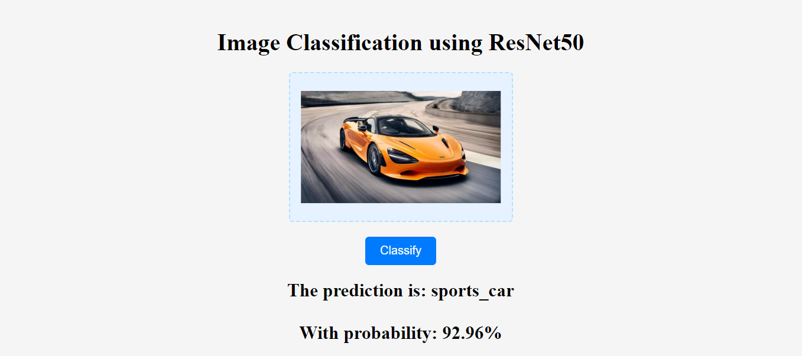
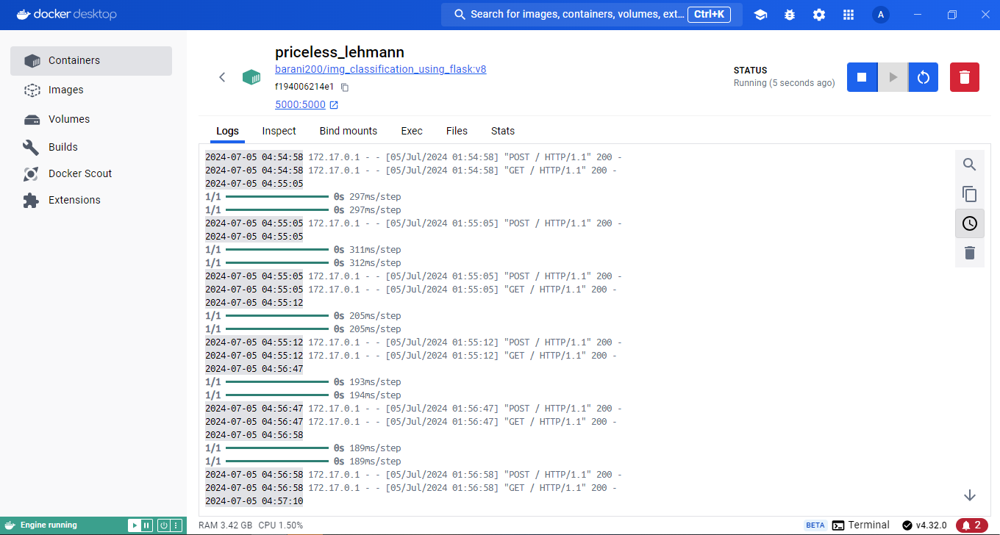
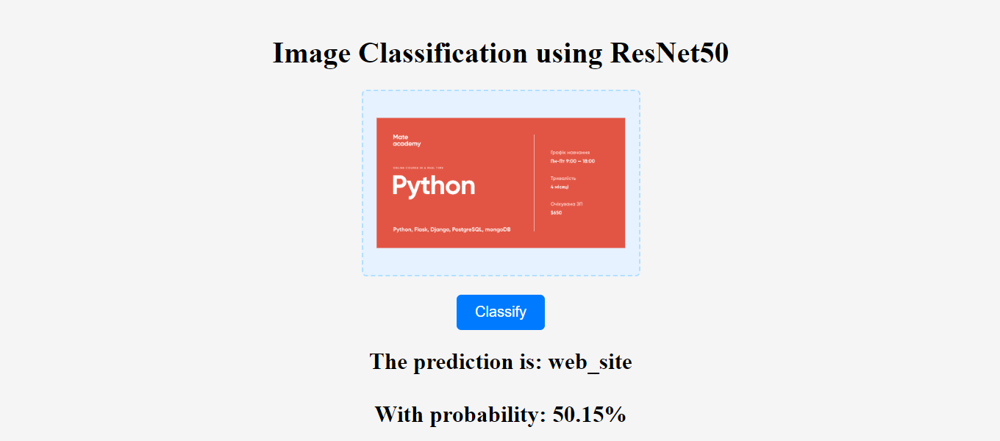
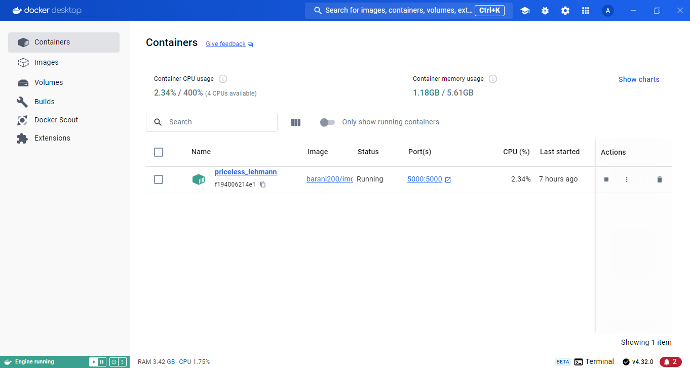

<h1>Image Classification Web App Using ResNet50 with Flask and Docker ⚽️🚘✈️🦮</h1>

### 🏞 Project Image:


<ul>
   <li><strong>This Flask project is a web app for classifying images.<strong></li>
   <li><strong>It uses a pre-trained ResNet50 model from the Keras library for image classification.<strong></li>
</ul>

## Project Demo Video:
https://github.com/ArtemLeo/image-classification-web-app/assets/105164053/420ef963-5837-4930-8829-ab5b0a50cc02

## How to Use the Web App:
- Upload an input image to the web app.
- The app will classify the image using the pre-trained ResNet50 model.
- The predicted class label and the prediction probability will be displayed.

### 🏞 Docker Image:


## Prerequisites
- Installed Docker Desktop.
- Flask (installed within the Docker container).

### 🏞 Mate Academy Image:


## How to Run Locally:

- Clone this repository using Git or GitHub Desktop.
- Open a terminal and navigate to the project directory.
- Build the Docker image: `docker build -t img_class .`
- Run the Docker container and map the host port `5000` to the container port 5000: `docker run -d -p 5000:5000 img_class`
- Open your web browser and visit `http://127.0.0.1:5000` to access the web app.
- **Note:** Be patient during the first run, as the ResNet50 model needs to be downloaded. This process may take some time.

### 🏞 Docker Image:


## How to Import the ResNet50 Model:
To import the pre-trained ResNet50 model in your Python code, use the following syntax:
```python
from keras.applications.resnet50 import ResNet50
```
